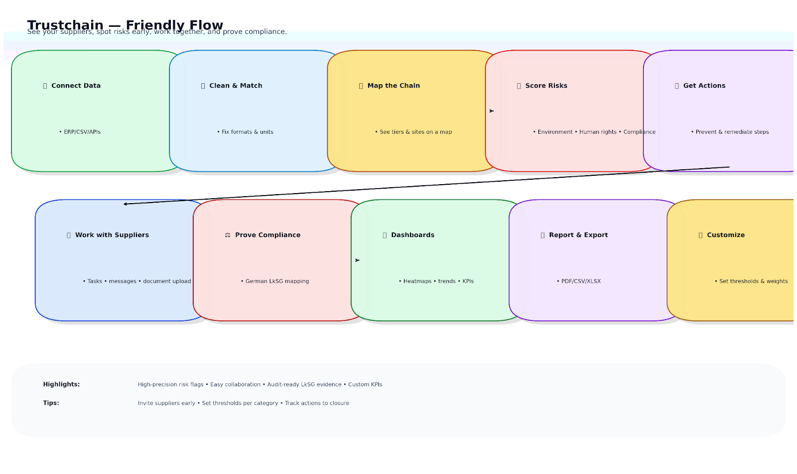
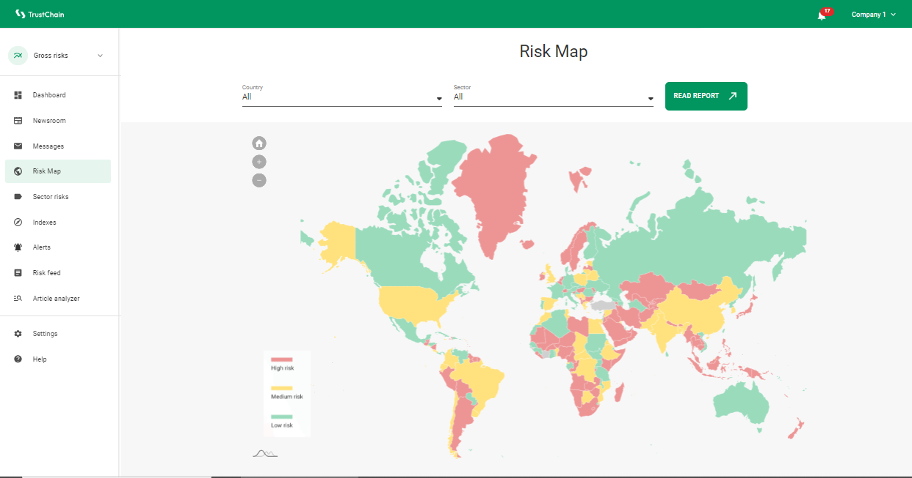
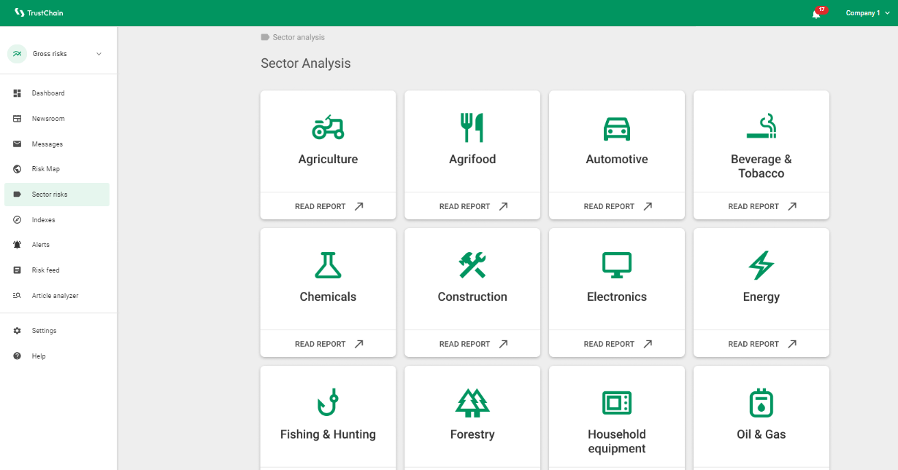
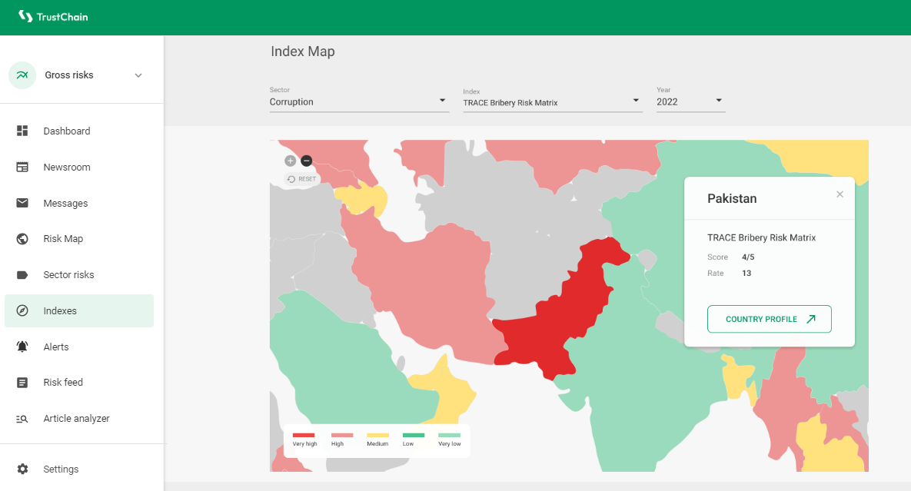
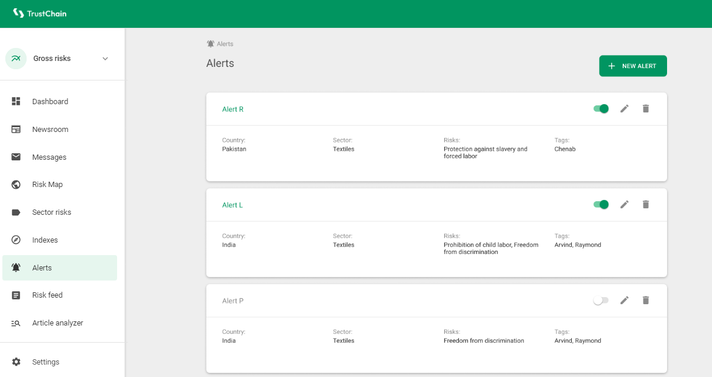
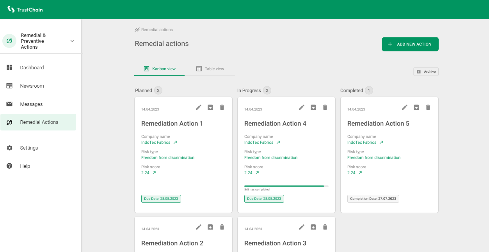
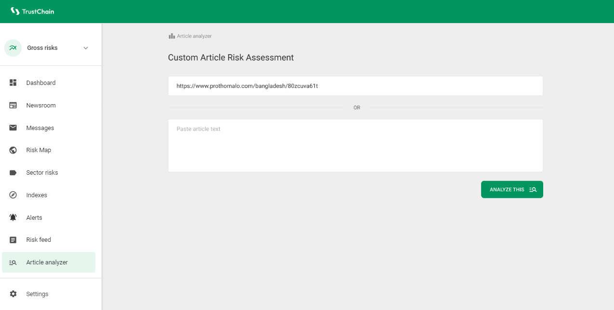
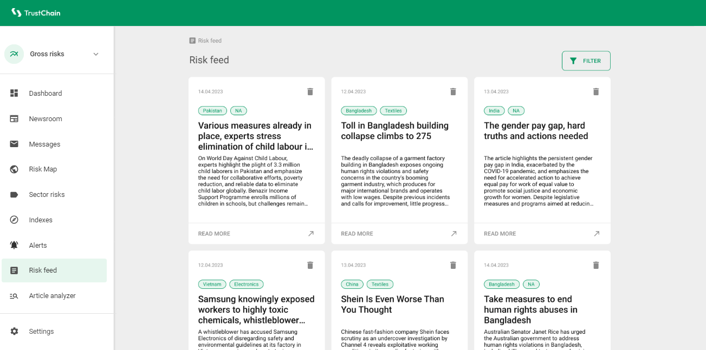
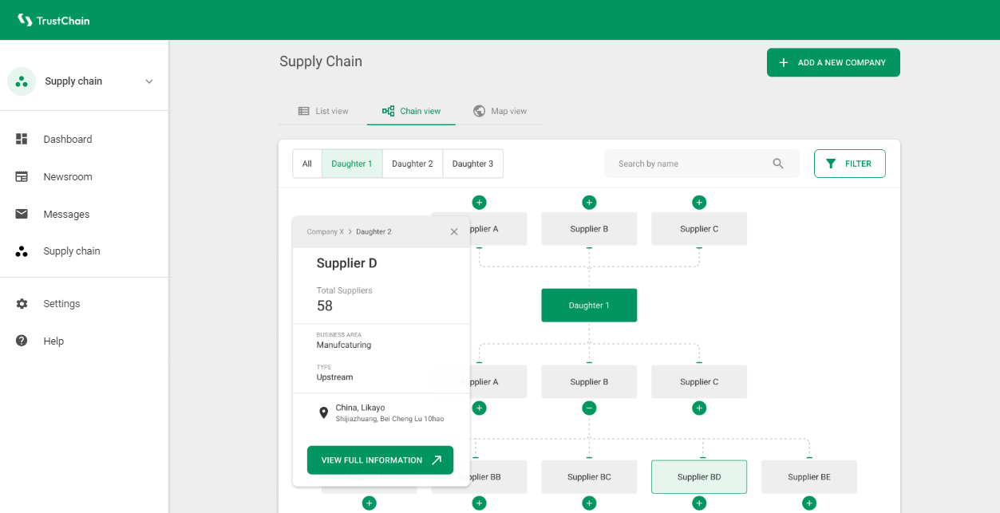

# Trustchain

**Trustchain** is a smart digital tool that helps companies better understand and manage their supply chains.  
Built with the help of **artificial intelligence**, Trustchain makes it easy for businesses to:

- Collaborate closely with suppliers
- Stay compliant with laws (e.g., the **German Supply Chain Due Diligence Act**)
- Spot risks such as environmental harm or human rights issues
- Track and report supply chain performance with customization

With its intuitive design and powerful insights, Trustchain supports more transparent, responsible, and sustainable operations—turning complex supply chain challenges into clear, manageable actions.

---

## 📊 Scheme

---

## ⚙️ Technical Description

Trustchain goes beyond traditional supply chain tools by offering:
- **Risk Analysis**: AI-driven assessment of environmental and human rights risks
- **Compliance Monitoring**: Automated checks against laws & policies
- **Remedial & Preventive Actions**: Built-in workflows for addressing risks
- **Complaint Mechanisms**: Transparent channels for reporting and resolving issues
- **Custom Dashboards**: Tailored reporting for ESG, carbon footprint, and ethical sourcing

---

## Examples Demo - Trustchain Demo

<table>
    <tbody>
        <tr>
            <td></td>
            <td></td>
        </tr>
        <tr>
            <td></td>
            <td></td>
        </tr>
        <tr>
            <td></td>
            <td></td>
        </tr>
        <tr>
            <td></td>
            <td></td>
        </tr>
    </tbody>
</table>

---

## 🎥 Demo

<table>
    <tbody>
        <tr>
            <td>
                <video src="https://github.com/user-attachments/assets/fd14721f-d75b-4d57-be8f-c49bb9670356" controls preload>
                    Your browser does not support the video tag.
                </video>
            </td>
            <td>
                <video src="https://github.com/user-attachments/assets/473284ca-5030-428c-8fdd-f544987b6dd7" controls preload>
                    Your browser does not support the video tag.
                </video>
            </td>
        </tr>
        <tr>
            <td>
                <video src="https://github.com/user-attachments/assets/25b4e31e-8519-42de-bd77-2f209597a511" controls preload>
                    Your browser does not support the video tag.
                </video>
            </td>
            <td>
                <video src="https://github.com/user-attachments/assets/95b8386e-48cd-4c3a-8368-933695c3ca4e" controls preload>
                    Your browser does not support the video tag.
                </video>
            </td>
        </tr>
        <tr>
            <td>
                <video src="https://github.com/user-attachments/assets/64a54179-5401-4def-a991-6eec112031a1" controls preload>
                    Your browser does not support the video tag.
                </video>
            </td>
            <td>
                <video src="https://github.com/user-attachments/assets/9148c27d-932c-402b-995b-4f7b02d2d883" controls preload>
                    Your browser does not support the video tag.
                </video>
            </td>
        </tr>
        <tr>
            <td>
                <video src="https://github.com/user-attachments/assets/4d2a7e2a-5f88-4902-8210-da78250fa5a9" controls preload>
                    Your browser does not support the video tag.
                </video>
            </td>
            <td>
                <video src="https://github.com/user-attachments/assets/7758980a-2d38-4448-a58f-ec9074ee2a57" controls preload>
                    Your browser does not support the video tag.
                </video>
            </td>
        </tr>
        <tr>
            <td>
                <video src="https://github.com/user-attachments/assets/02a70584-9cc6-4aae-9ffb-af5f98de2323" controls preload>
                    Your browser does not support the video tag.
                </video>
            </td>
            <td>
                <video src="https://github.com/user-attachments/assets/8ec4ca3c-49f2-4da6-9613-940ba61089bc" controls preload>
                    Your browser does not support the video tag.
                </video>
            </td>
        </tr>
    </tbody>
</table>

---

## 🛠️ Process & Technologies

### Pre-Processing
- **Data Collection**: Supplier info, ESG data, compliance history
- **Cleaning & Normalization**: Standardizing formats and ensuring accuracy
- **Feature Engineering**: Extracting supplier performance & compliance indicators

### Machine Learning Models
- **Random Forest** → Risk Assessment
- **Logistic Regression** → Compliance Evaluation
- **Gradient Boosting** → Sustainability Analysis
- **Neural Networks** → Overall analysis of interconnected risks

### Training & Validation
- Data splitting (train/validation sets)
- Model training with iterative refinement
- Metrics: Accuracy, Precision, Recall, F1 Score, ROC-AUC, MAE

---

## 📈 Evaluation & Achievements

- ✅ **High precision** in environmental and human rights risk assessment
- ✅ **User customization** for risk thresholds & reporting
- ✅ **Seamless UI** for collaboration and decision-making

---

## 🚀 Future Scope
- Integration of **deep learning (Transformers)** for advanced risk insights
- Expansion to **IoT, blockchain, and satellite data sources**
- Wider adoption via user feedback loops and continuous iteration

---

## 📚 References
- *Sustainable Supply Chain Management* – Wendy Tate
- *Ethics of Artificial Intelligence and Robotics* – Vincent C. Müller
- *Hands-On Machine Learning with Scikit-Learn, Keras, and TensorFlow* – Aurélien Géron
- *Neural Networks and Deep Learning* – Charu C. Aggarwal
- *Deep Learning* – Ian Goodfellow, Yoshua Bengio, Courville
- *The German Act on Corporate Due Diligence Obligations in Supply Chains* – BMZ

---
